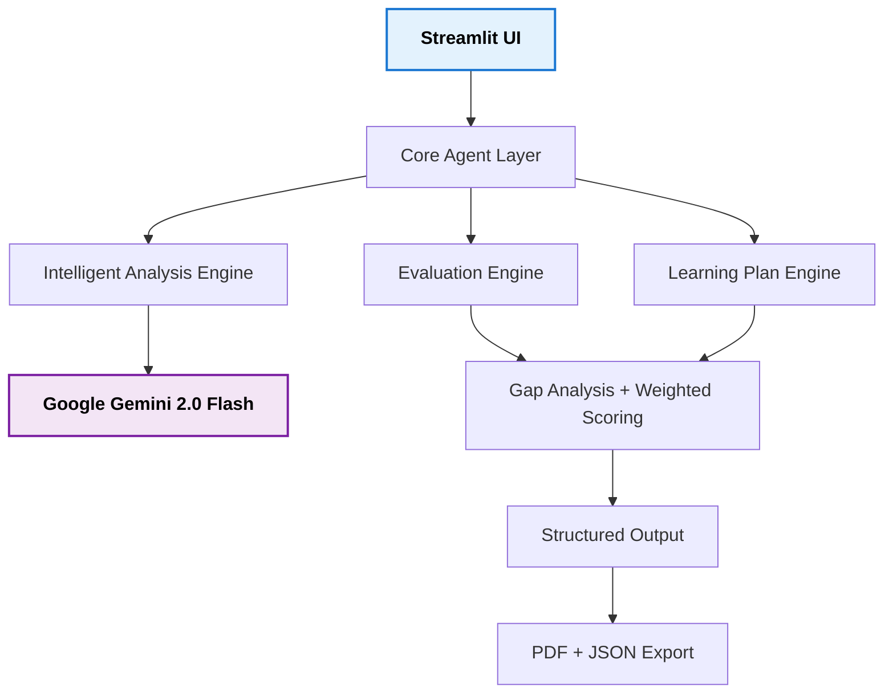

# 🧠 SkillBridge AI

**AI-Powered Skill Assessment & Personalized Learning Agent** *Bridging Clinical Psychology into HR & Organizational Development*

---

## 🚀 Live Demo
**[Open SkillBridge AI](https://catalyst-hackathon-38leseklrwbr9xfnesneo6.streamlit.app/)**

> **Recommended for Demo**: Click **"🎯 Load HR Executive Demo"** — it auto-runs the full analysis.

---

## 📋 Problem Statement

A resume shows **what** a candidate claims to know.  
SkillBridge AI reveals **how well** they actually know it and provides a clear path to close the gaps using Organizational Psychology principles.

---

## 🏗️ Architecture



---

## 🎯 Full Demo: Input → Output

### 1. Input Data
**Job Description (HR Executive):**
We are hiring an HR Executive with strong expertise in:
- Communication and Stakeholder Management
- Conflict Resolution and Mediation
- Employee Engagement and Retention Strategies
- Recruitment and Talent Acquisition
- Emotional Intelligence and Team Dynamics
Candidate Resume:
MA in Clinical Psychology (2025). 1 year experience as Counselor. 
Skilled in empathy, active listening, and emotional regulation.
Limited corporate HR exposure but strong foundation in human behavior.

### 2. Analysis Results

**Executive Summary:**
* **Match Percentage:** 68%
* **Summary:** Strong psychological foundation with excellent emotional intelligence. Needs corporate HR exposure in recruitment and stakeholder management.

| Skill | JD Required | Current Level | Gap | Priority |
| :--- | :---: | :---: | :---: | :--- |
| **Emotional Intelligence** | 5 | 4 | 1 | Low |
| **Communication** | 5 | 3 | 2 | High |
| **Conflict Resolution** | 5 | 3 | 2 | High |
| **Employee Engagement** | 4 | 2 | 2 | Medium |
| **Recruitment** | 4 | 1 | 3 | High |

---

## 🌟 Real-World Use Case: The "Career Switcher" (Teacher to PM)

This use case demonstrates the agent's ability to identify transferable psychological traits in non-standard candidates.

* **Input - Job Description (EdTech Product Manager):** Requires user research, stakeholder management, empathy-driven UX design, and roadmap prioritization.
* **Input - Candidate Resume (Secondary School Teacher):** 6 years experience in curriculum design, behavioral management of diverse groups, and data-driven student performance tracking.
* **Agent Insight:** The engine recognizes **"Classroom Behavioral Management"** as a direct transferable skill for **"High-Stakes Stakeholder Mediation"** and **"Curriculum Design"** as a foundation for **"Product Roadmapping."**

---

## 🧠 Scoring & Assessment Logic

SkillBridge AI employs a weighted gap-analysis algorithm grounded in Organizational Psychology: 

* **Weighted Alignment:** The "Match Percentage" is not a simple keyword count; it is a weighted average comparing the JD's "Required Level" against evidence-based "Demonstrated Levels" found in the resume.
* **Psychological Mapping:** The engine specifically looks for "bridge skills"—clinical traits like empathy and active listening are mapped to corporate competencies like negotiation and leadership.
* **Gap Prioritization:** Gaps are calculated as:  
    $$Required - Demonstrated$$  
    Any gap $\ge 2$ is automatically flagged as **"High Priority"** for the Learning Plan.

---

## 🛠️ Local Setup

To run this project locally for testing:

1.  **Clone the repository:**
    ```bash
    git clone [https://github.com/sai-6/Catalyst-hackathon](https://github.com/sai-6/Catalyst-hackathon)
    ```
2.  **Install dependencies:**
    ```bash
    pip install -r requirements.txt
    ```
3.  **Configure Secrets:**
    Create a `.streamlit/secrets.toml` file and add your API key:
    ```toml
    GOOGLE_API_KEY = "YOUR_GEMINI_API_KEY"
    ```
4.  **Launch the App:**
    ```bash
    streamlit run app.py
    ```
## 📚 Personalized Learning Plans

* **Conflict Resolution:** Harvard online: 'Negotiation Mastery', role-play corporate mediation exercises.
* **Recruitment:** LinkedIn Recruiter certification, ATS (Applicant Tracking System) training.

---

## 🧠 About the Author

**Arunjyoti Das** *MA Clinical Psychology (2025) | BA Psychology (2020)* This project merges clinical insight with AI to solve modern HR challenges. It was built for the **Deccan AI Catalyst Hackathon** to turn psychological insights into practical talent development solutions.

---

*Made with ❤️ by Arunjyoti Das*